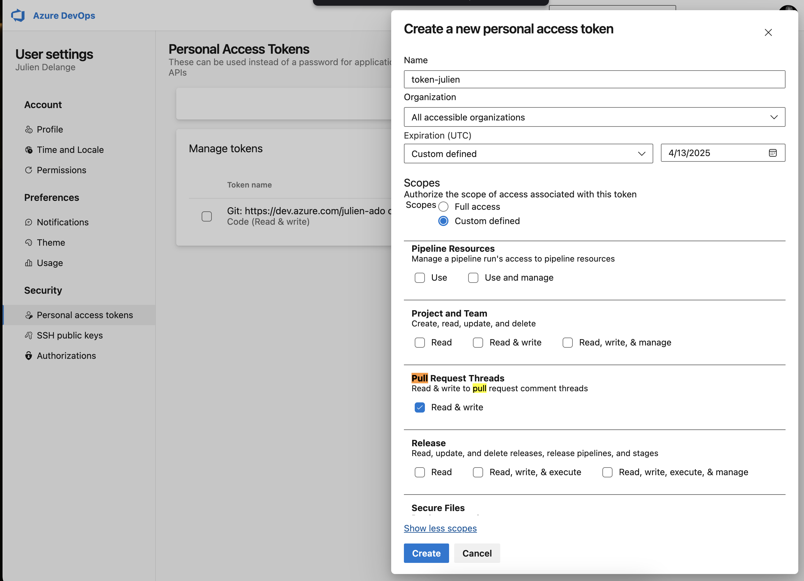
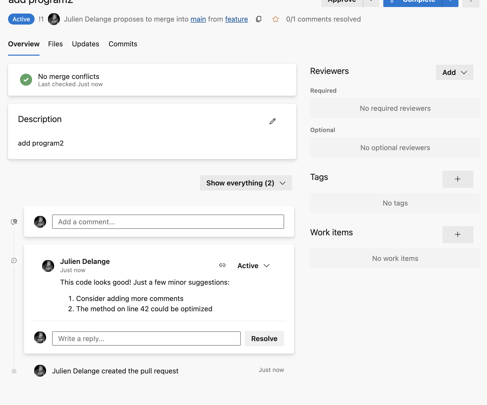
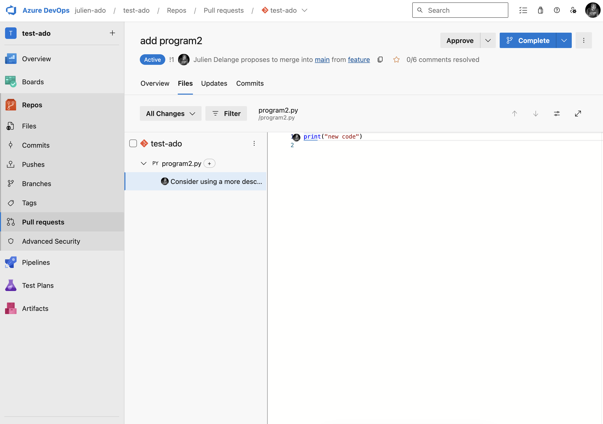

# Azure DevOps POC

## Getting your token

Signup for Azure Devops.

Then, generate a token.

See the following pictures as to how to generate the token.



## Setup

First, export your token under the variable `ADO_TOKEN`

```shell
export ADO_TOKEN=<your-token>
```

Then, install dependencies

```shell

./bootstrap.sh

```

### Get a code snippet

Edit `code-snippet.py` with the parameters of your repository and run.


### Post a Summary PR comment


Edit `pull-request-summary-comment.py` and run.




### Post a comment in a file


Edit `pull-request-file-comment.py` and run.




## Special Thanks

Special thanks to my [Claude.ai](https://claude.ai/) subscription that got this done in 30 mins.